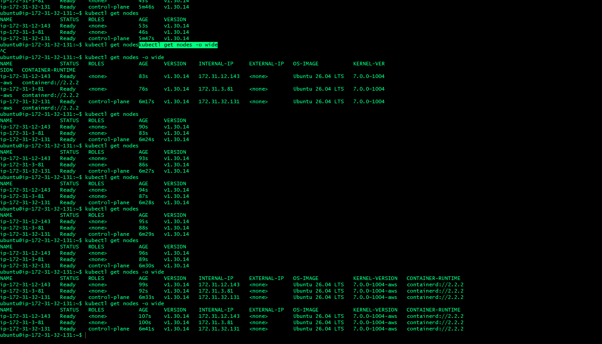
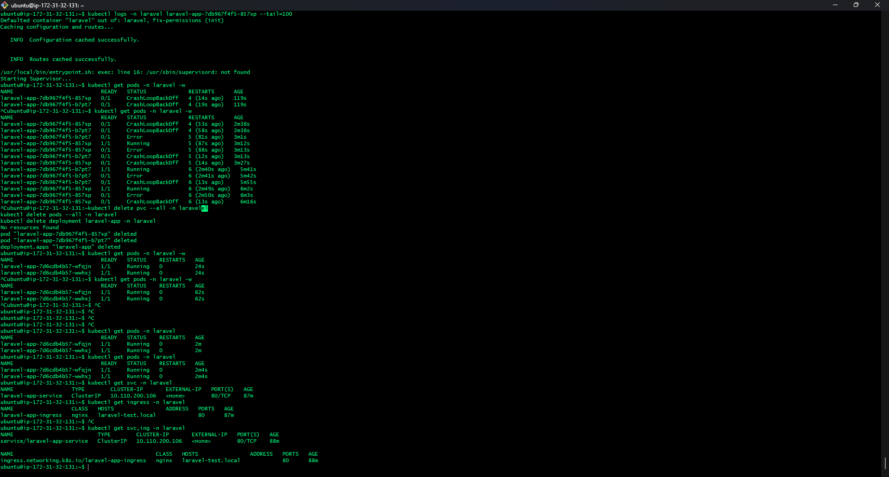
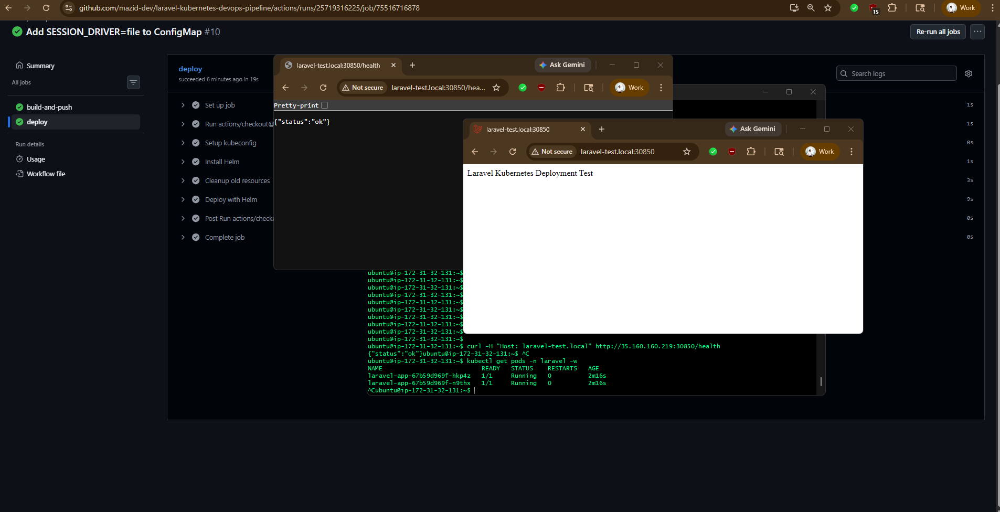
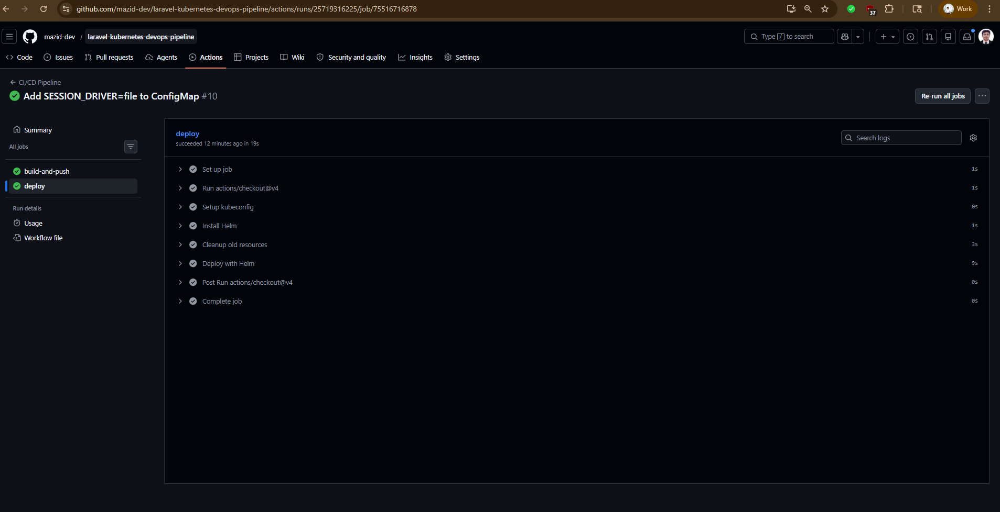

# 🚀 Laravel on Kubernetes

### Production-Style DevOps Deployment using Kubernetes, Docker, Helm & GitHub Actions


---

## 📌 Project Overview

This project demonstrates a complete **end-to-end DevOps workflow** for deploying a **Laravel 11 application** on a self-managed Kubernetes cluster using:

- Docker
- Kubernetes (kubeadm)
- Helm
- GitHub Actions CI/CD
- AWS EC2

The deployment pipeline is fully automated. Every push to GitHub automatically builds a Docker image, pushes it to Docker Hub, and deploys the latest version into the Kubernetes cluster using Helm.

---

# 🏗️ Architecture

```text
Developer
    │
    ▼
GitHub Repository
    │
    ▼
GitHub Actions (CI Pipeline)
    │
    ├── Docker Build
    └── Docker Push → Docker Hub
                          │
                          ▼
               GitHub Actions (CD)
                          │
                          ▼
                  Helm Deployment
                          │
                          ▼
          Kubernetes Cluster (kubeadm)
        ┌──────────────────────────────┐
        │ Master Node                  │
        │ Worker Node 1                │
        │ Worker Node 2                │
        └──────────────────────────────┘
                          │
                          ▼
               Nginx Ingress Controller
                          │
                          ▼
                 NodePort : 30850
                          │
                          ▼
                     Browser User


⚙️ Tech Stack

| Category               | Technology                   |
| ---------------------- | ---------------------------- |
| Application            | Laravel 11 (PHP 8.2 + Nginx) |
| Containerization       | Docker (Multi-stage Build)   |
| Orchestration          | Kubernetes (kubeadm v1.30)   |
| Package Management     | Helm                         |
| CI/CD                  | GitHub Actions               |
| Cloud Platform         | AWS EC2 (Ubuntu 22.04)       |
| Networking             | Calico CNI + Nginx Ingress   |
| Container Registry     | Docker Hub                   |


🚀 Key Features

✅ Fully Containerized Laravel Application
✅ Kubernetes Cluster (1 Master + 2 Workers)
✅ Automated CI/CD Pipeline
✅ Helm-Based Deployment Strategy
✅ Nginx Ingress Controller
✅ Health Check Endpoint (/health)
✅ Rolling Update Deployment
✅ Production-Style Infrastructure
✅ Real-World Troubleshooting Experience


## 🧱 Deployment Workflow

  1️⃣ Laravel Application Setup
        Laravel 11 project initialization
        Added /health route for Kubernetes health checks

  2️⃣ Dockerization
        Multi-stage Docker build
        PHP-FPM + Nginx configuration
        Non-root user implementation
        Supervisor process management

  3️⃣ Kubernetes Cluster Setup
        kubeadm-based cluster initialization
        Calico CNI installation
        Worker node configuration
        Nginx Ingress Controller setup

  4️⃣ Helm Deployment
        Deployment
        Service
        Ingress
        ConfigMap
        Secret
        Health probes

  5️⃣ CI/CD Automation

    GitHub Actions pipeline automatically:
        Builds Docker image
        Pushes image to Docker Hub
        Deploys application using Helm


🐞 Major Issues & Solutions        

| Issue                      | Cause                         | Solution                              |
| -------------------------- | ----------------------------- | ------------------------------------- |
| Nodes showing `NotReady`   | Missing CNI                   | Installed Calico                      |
| Worker node failed to join | Swap enabled                  | Disabled swap                         |
| Ingress webhook failure    | Webhook validation issue      | Removed invalid webhook configuration |
| PVC stuck in Pending       | No StorageClass               | Disabled persistence                  |
| Laravel session error      | Database session driver issue | Set `SESSION_DRIVER=file            |
| Supervisor startup failure | Wrong executable path         | Fixed supervisord path                |
| Application inaccessible   | Security Group issue          | Opened NodePort 30850                 |


✅ Final Result

| Component         | Status       |
| ----------------- | ------------ |
| Kubernetes Pods   | ✅ Running    |
| Health Check API  | ✅ Working    |
| Browser Access    | ✅ Accessible |
| CI/CD Pipeline    | ✅ Automated  |
| Docker Deployment | ✅ Successful |


## 📸 Screenshots

#### 1. Kubernetes Cluster Status (Nodes Ready)


#### 2. Kubernetes Pods Status


#### 3. Web Browser Access


#### 4. GitHub Actions Pipeline Success



🧠 What I Learned

        Docker multi-stage image optimization
        Kubernetes cluster administration
        kubeadm production-style setup
        Helm chart templating
        Kubernetes networking with Calico
        Ingress configuration
        GitHub Actions CI/CD automation
        Real-world DevOps troubleshooting
        Laravel production deployment practices

🔮 Future Improvements
        MySQL Deployment (RDS / StatefulSet)
        Persistent Volume Support
        Horizontal Pod Autoscaler (HPA)
        HTTPS with Cert-Manager
        Prometheus & Grafana Monitoring
        GitOps using ArgoCD

👨‍💻 Author
Md Mazid Hossain
📧 Contact: 01739365972
